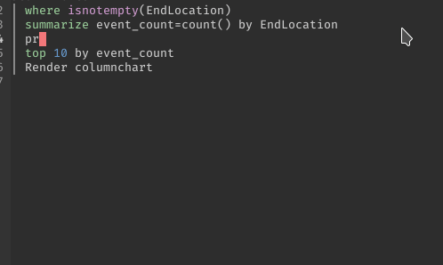

# lsp-kusto

lsp-mode client for kusto language. Requires the [Kuskus](https://github.com/rosshamish/kuskus/tree/master/kusto-language-server) language server.

```shell
git clone https://github.com/rosshamish/kuskus
cd kuskus/kusto-language-server
npm install
npm run compile
readlink -f server/out/server.js
```
Set `kuskus-server-location` with outputted location.


